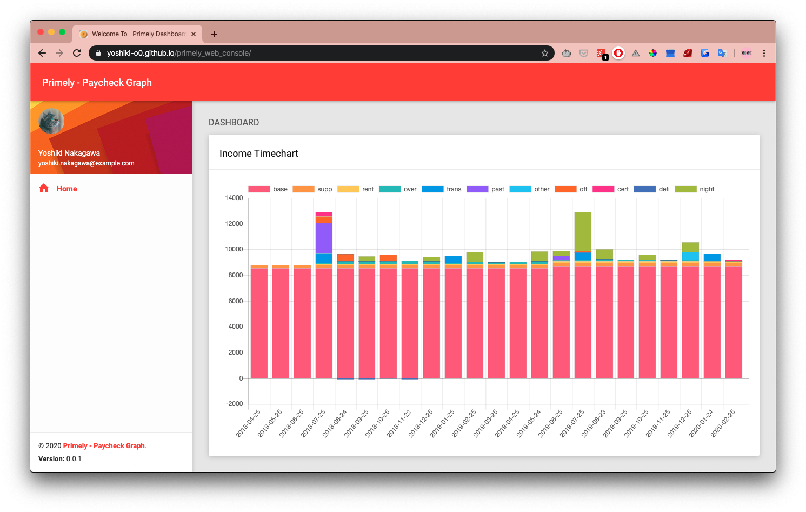

# Primely Docker Flask

<!-- ##### Analyse your paycheck -->

[](https://shields.io/)




**Update(May 18, 2020)**:

## Description

Containerized web app for visualizing paychecks

## Get Started with Primely
<!-- TODO Update below dates every time you commit!  -->

### Prerequisites

Make sure you have already installed both Docker Engine and Docker Compose.
You don’t need to set your local Python environment,
as it'll be provided by Docker image.

### Step 1: Setup

Git clone the latest repository. (e.g. \<branch-name> = release/v0.0.1, \<path-to-local-repo> = primely_docker_flask)

```bash
git clone -b <branch-name> https://github.com/yoshiki-o0/primely_docker_flask.git
cd <path-to-local-repo>
```

### Step 2: Build and run container

```bash
docker-compose up
```

### Step 3:Access application

Hit `127.0.0.1:5000` on your browser

## Interface manual

| Button | Description |
|---|---|
| `Choose Files`| Select paycheck PDF files to upload to server|
| `Upload`| Commit upload on selected files|
| `Run`| Execute conversion for the uploaded files. Run `View` on success|
| `View`| Draw a chart based on loaded data from server|
| `Reset`| Remove converted data on server|
| `Delete`| Remove all PDF files on server|

## Relative Docker Commands

**Build a docker image from the Dockerfile:**

```bash
docker build --no-cache -t <image-name> <path/to/Dockerfile>
```

**Create a docker container from the Dockerfile:**

```bash
docker run -p 0.0.0.0:5000:80/tcp --name <container-name> -d <image-id>
docker run -it 0.0.0.0:5000:80/tcp --name <container-name> -d <image-id> bash
```

**Stop container:**

```bash
docker-compose stop
```

**Remove container:**

```bash
docker-compose down
```

**Exit from a docker container:**

Mac:
`ctrl-D`

## Licence

Primely is freely available for free non-commercial use and may be redistributed under conditions. Please, see the licence for further details.
