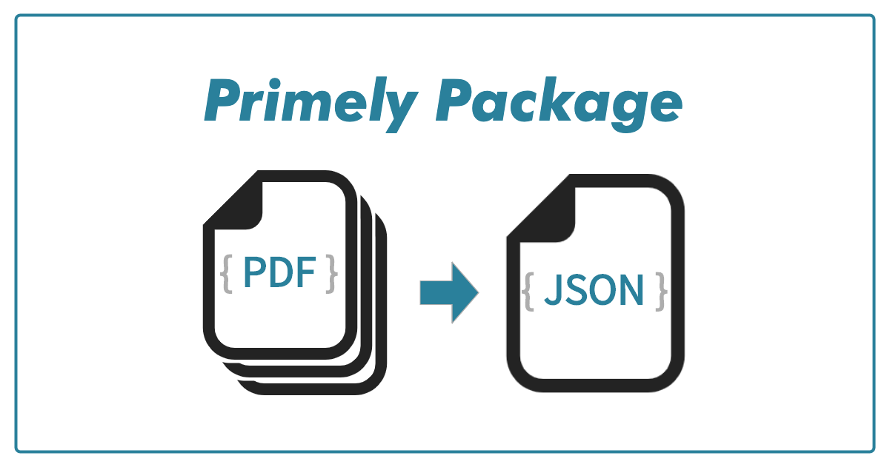

# Primely Package

<!-- ##### Analyse your paycheck -->

[](https://shields.io/)

<!--  -->


## Getting Started
<!-- TODO: Update below dates every time you commit!  -->
**Update(April 18, 2020)**: Paycheck at where I work is published by a PDF file. Just reading them, might be enough for checking errors, but do you not want to see *trends* over time?

This package can provide a json response where a series of paychecks are organized and stored in one file. Download and try putting your pdf file in the suggested folder where instructed below.

### Prerequisites
* Paycheck downloaded (in pdf format). 
* You are either my colleague or/and work at the same company. Because **this package only works for paychecks from where I work now**.


### Installing
Git clone the latest repository. (e.g. <branch_name> = release/v0.0.1)
```bash
$ git clone -b <branch_name> https://github.com/yoshiki-o0/primely_package.git
```

Move to the home directory of the package.
```bash
$ cd primely_package
```

Create virtualenv if needed. Recommended python version is v3.7.4
```bash
$ virtualenv -p python3 <desired_path>
$ source <desired_path>/bin/activate
```

Install dependent packages.
```bash
$ pip install --upgrade -r requirements.txt
```

### Running the test
<!-- ### Process your data -->

Set your pdf files at `data/input/`. Create a directory if it doesn't exist.

Run <br>
```bash
$ python <package_home_dir_path>/main.py
```

### Check your json
If the process completes successfully, the json response will be extracted under `data/output/json/`.


## Utilize as a package
### Extract from tarball
Download tarball from `primely_package/dist/<package_name>`.

Move to the work directory where tarball is set.
```bash
$ cd <path_to_work_dir>
```

Extract the package.
```bash
$ tar -zxvf <package_name>
```

## Built With
* [pdfminor.six](https://github.com/pdfminer/pdfminer.six) - Used to extract text from pdf files.

## Polished With
* pepe8, flake8, (Comming soon) pylint
* Unittest

## Licence
Primely is freely available for free non-commercial use and may be redistributed under conditions. Please, see the licence for further details.