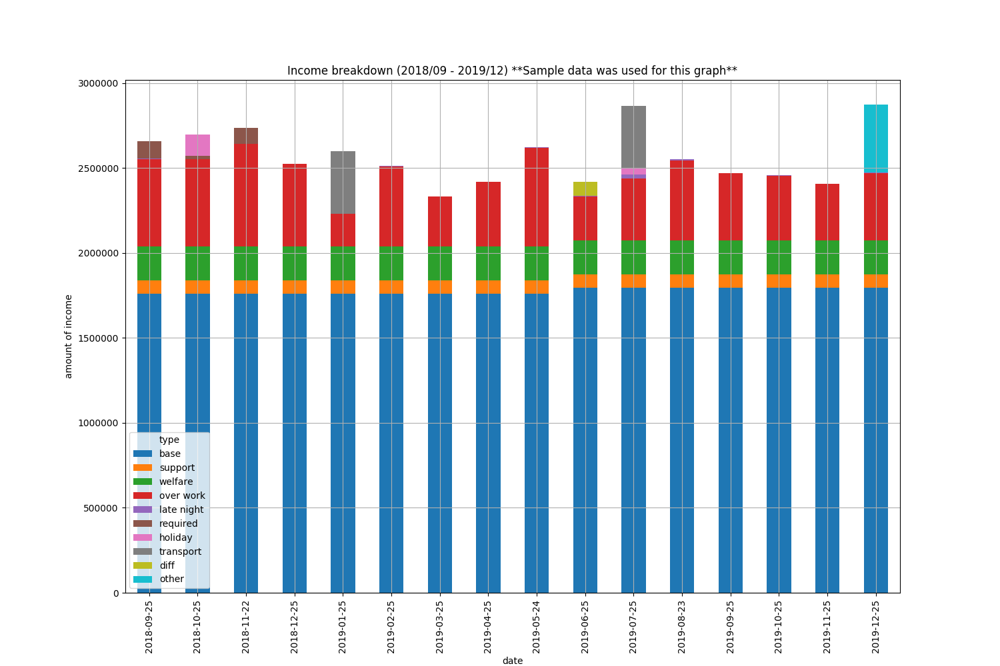
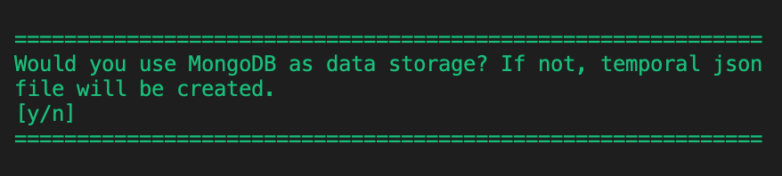

# PaycheckGraph

<!-- ##### Analyse your paycheck -->

[](https://shields.io/)
[](https://shields.io/)

<!--  -->


## Roadmap
* [v1.0.0] Export paycheck data to graph image. 
* [v1.1.0] Store data to MySQL. 
* [v1.2.0] Visualize paycheck data using Grafana.
* [new] Create iOS App version. 

## Getting Started
<!-- TODO: Update below dates every time you commit!  -->
**Update(March 1, 2020)**: Paycheck at where I work is published by a PDF file. Just reading them, might be enough for checking errors, but do you not want to see *trends* over time?

This package creates statical graphs of your paycheck! Download it and try putting your pdf file in the suggested folder where instructed below.

### Prerequisites
* Paycheck downloaded (in pdf format). 
* You are either my colleague or/and work at the same company. Because **this package only works for paychecks from where I work now**.


### Installing
Install MongoDB to your local environment.
<br>
>See
[The Official MongoDB Software Homebrew Tap](https://github.com/mongodb/homebrew-brew).

Git clone this repository.
```bash
$ git clone https://github.com/yoshiki-o0/paycheck_graph.git
```

Pip install *requirements.txt*.
```bash
$ pip install requirements.txt
```

## Running the test
### Analyse your data
Set your pdf files at `data/pdf`.

Run <br>
```bash
$ python main.py
```
Follow the dialog accordingly.


### Check your graph
If the application runs successfully, the graph would be outputted at `data/output/graphs_and_charts`.


## Built With
* [pdfminor.six](https://github.com/pdfminer/pdfminer.six) - Used to extract text from pdf files.
* [MongoDB](https://github.com/mongodb/mongo) - Database used.

## Polished With
* pepe8, flake8, (Comming soon) pylint
* (Comming soon) Unittest

## Licence
PaycheckGraph is freely available for free non-commercial use and may be redistributed under conditions. Please, see the licence for further details.